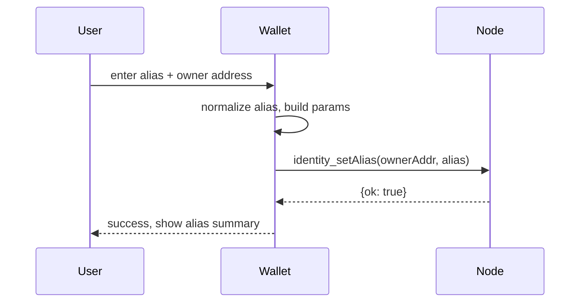
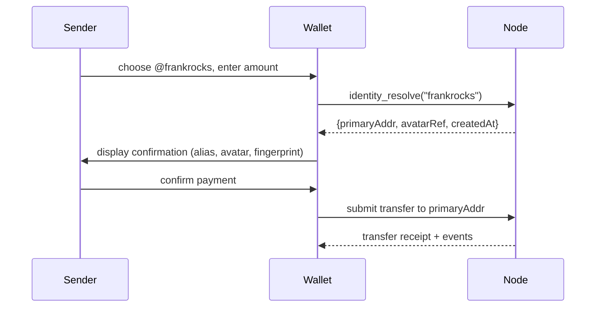
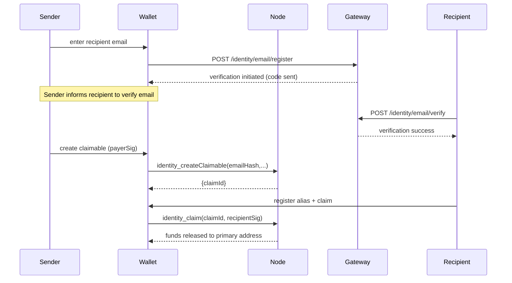

# Identity & Username Directory

> Version: v0 • Module: `identity`

## Overview

The NHBChain identity subsystem provides human-readable aliases (usernames) that map to on-chain account addresses, opt-in email
association for discovery, avatar references for consistent presentation, and "pay-by-username" user experiences. Aliases are
first-class state objects recorded on-chain, while sensitive metadata such as email verification is handled off-chain by the
identity gateway service. Together they allow wallets, gateways, and merchants to offer:

* Deterministic resolution of `@aliases` to rich metadata (primary settlement address, address set, avatar, timestamps).
* Rich sender safety cues (avatar, created-at timestamp, address fingerprint).
* Pay-by-email flows that bridge new users through claimable escrows.
* A consistent UX that complements existing escrow flows (see [Escrow Guide](../escrow/escrow.md)).

## Terminology

| Term | Description |
| --- | --- |
| **Alias** | Human-readable username, globally unique, referenced as `@alias` in UX. |
| **Alias ID** | Stable 32-byte identifier for an alias record; used internally and exposed in APIs as `aliasId`. |
| **Primary Address** | Address flagged as the default payout target for `pay-by-username` flows (alias owner). |
| **Linked Addresses** | Additional Bech32 addresses controlled by the owner. |
| **AvatarRef** | HTTPS URL or on-chain blob reference representing the alias avatar. |
| **Claimable** | Escrow-like placeholder created when paying an unresolved alias/email; funds release once the claimant proves knowledge of the recipient hint. |

## Normalization & Uniqueness Rules

* Aliases are normalized to lower-case and NFC (`unicode.org/reports/tr15/`), with secondary NFKC pass for compatibility.
* Allowed characters: ASCII letters (`a–z`), digits (`0–9`), dot (`.`), underscore (`_`), and hyphen (`-`).
* Length: minimum 3, maximum 32 Unicode code points after normalization.
* Uniqueness is case-insensitive (`FrankRocks` and `frankrocks` resolve to the same canonical alias).
* Reserved names: governance publishes a list (e.g., `admin`, `support`, trademarks). Reserved names throw `IDN-001`.
* Confusable/homoglyph aliases are blocked (leverages Unicode security profile). Punycode-only names are rejected; users should
  choose ASCII-native aliases. Guidance is provided in CLI and RPC error payloads.

## Alias State Model (On-Chain)

Alias records are stored deterministically by ID, and mutation requires an owner-signed message.

```go
// Pseudocode representation
type AliasRecord struct {
  Alias     string
  Primary   [20]byte
  Addresses [][20]byte
  AvatarRef string
  CreatedAt int64
  UpdatedAt int64
}
```

* `Alias`: canonical, normalized alias string.
* `Primary`: bech32 account that owns the alias and receives settlement by default.
* `Addresses`: unique set of addresses controlled by the owner (always includes `Primary`).
* `AvatarRef`: HTTPS or `blob://` reference; omitted when unset.
* `CreatedAt`/`UpdatedAt`: Unix timestamps emitted on first registration and subsequent mutations.

### Lifecycle Events

The chain emits events for watchers and analytics:

| Event | Trigger |
| --- | --- |
| `identity.alias.set` | Alias registered for an address for the first time. |
| `identity.alias.renamed` | Alias string changed for an existing address mapping. |
| `identity.alias.avatarUpdated` | AvatarRef changed.

Mermaid sequence for alias registration:



## Off-Chain Email Directory & Gateway

* Verified emails are stored off-chain by the identity gateway.
* Each entry stores a salted hash (`H = HMAC(salt, emailLowerNFKC)`) and verification metadata (`verifiedAt`, `method`).
* Mapping: `emailHash -> aliasId`. Users must opt-in to expose alias lookups by email.
* No plaintext emails are stored on-chain; the alias record only stores the `aliasId`.

## Claimables (Escrow Holds for New Users)

Pay-by-email and unclaimed alias scenarios rely on claimables, interoperable with the escrow module.

```go
type Claimable struct {
  ClaimID       [32]byte
  Payer         [20]byte
  Token         string
  Amount        *big.Int
  RecipientHint [32]byte // aliasId or email hash preimage
  Expiry        int64
  CreatedAt     int64
}
```

* Claimables are created by senders when the recipient alias/email cannot yet resolve.
* Funds are held in the identity escrow submodule. Upon `identity_claim`, the amount is released to the claimant's address once
  the provided preimage matches `RecipientHint`.
* Events emitted: `identity.claimable.created`, `identity.claimable.claimed`, `identity.claimable.expired`.
* Claimables integrate with the [Escrow module](../escrow/escrow.md#1-overview) for audit and settlement guarantees.

### Pay-by-Username Flow



### Pay-by-Email (Claimable) Flow



## Threat Model & Mitigations

| Threat | Mitigation |
| --- | --- |
| Alias squatting | Governance-managed reserved list; cooldown periods after release; optional staking deposit. |
| Homoglyph spoofing | Unicode confusable detection and strict ASCII policy; wallets display creation timestamp & address
  fingerprint. |
| Unauthorized mutations | All mutating RPCs require owner signatures (EIP-191) with nonce + expiry; replay protection enforced. |
| Rate-based abuse | Gateway enforces per-IP/user rate limits and API-key HMAC auth. |
| Avatar abuse | Content policy scanning (size/type), moderated by gateway; on-chain references may be flagged by governance. |
| Email harvesting | Only salted hashes stored; lookup requires opt-in; DSAR processes allow deletion. |
| Claimable hijack | Claim requires recipient signature bound to aliasId/email hash; expiry auto-refunds payer; audit logs track
  claims.

---

## Deterministic State Transition Guarantees

* Every alias mutation increments `version` and emits an event with `txHash` for audit trails.
* On-chain storage enforces deterministic ordering by `blockHeight` and `txIndex`.
* Claimable settlements leverage escrow vaults, ensuring funds are never minted or destroyed outside normal transfer logic.

## Related Documents

* [Identity JSON-RPC Reference](./identity-api.md)
* [Identity Gateway REST API](./identity-gateway.md)
* [Pay by Username & Email Flows](./pay-by-username.md)
* [Avatar Specification](./avatars.md)
* [Security, Privacy & Compliance Brief](./identity-security-compliance.md)
