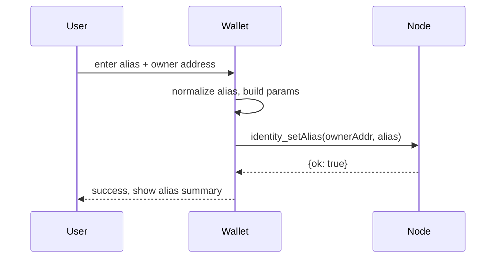
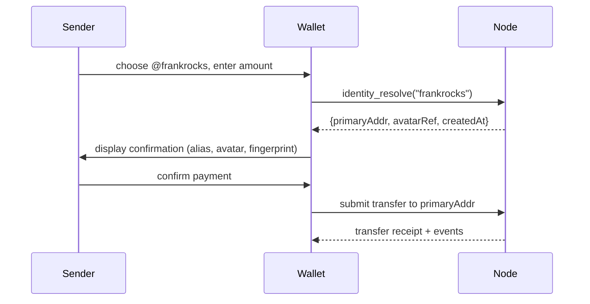
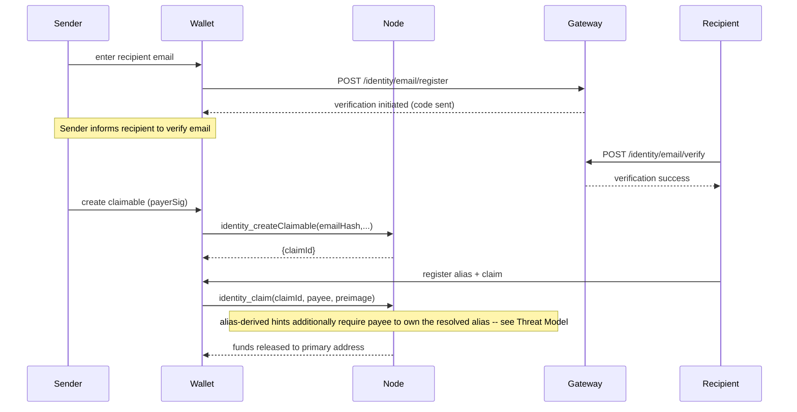

# Identity & Username Directory

> Version: v0 • Module: `identity`

## Overview

The NHBChain identity subsystem provides human-readable aliases (usernames) that map to on-chain account addresses, opt-in email
association for discovery, avatar references for consistent presentation, and "pay-by-username" user experiences. Aliases are
first-class state objects recorded on-chain, while sensitive metadata such as email verification is handled off-chain by the
identity gateway service. Together they allow wallets, gateways, and merchants to offer:

* Deterministic resolution of `@aliases` to rich metadata (primary settlement address, address set, avatar, timestamps).
* Rich sender safety cues (avatar, created-at timestamp, address fingerprint).
* Pay-by-email flows that bridge new users through claimable escrows.
* A consistent UX that complements existing escrow flows (see [Escrow Guide](../escrow/escrow.md)).

## Terminology

| Term | Description |
| --- | --- |
| **Alias** | Human-readable username, globally unique, referenced as `@alias` in UX. |
| **Alias ID** | Stable 32-byte identifier for an alias record; used internally and exposed in APIs as `aliasId`. |
| **Primary Address** | Address flagged as the default payout target for `pay-by-username` flows (alias owner). |
| **Linked Addresses** | Additional Bech32 addresses controlled by the owner. |
| **AvatarRef** | HTTPS URL or on-chain blob reference representing the alias avatar. |
| **Claimable** | Escrow-like placeholder created when paying an unresolved alias/email; funds release once the claimant proves knowledge of the recipient hint. |

## Normalization & Uniqueness Rules

* Aliases are normalized by trimming surrounding whitespace and lower-casing (ASCII); there is no Unicode NFC/NFKC
  normalization pass.
* Allowed characters: ASCII letters (`a–z`), digits (`0–9`), dot (`.`), underscore (`_`), and hyphen (`-`), enforced by the
  pattern `^[a-z0-9._-]+$`.
* Length: minimum 3, maximum 32 characters after normalization.
* Uniqueness is case-insensitive (`FrankRocks` and `frankrocks` resolve to the same canonical alias).

## Alias State Model (On-Chain)

Alias records are stored deterministically by ID, and mutation requires an owner-signed message.

```go
// Pseudocode representation
type AliasRecord struct {
  Alias     string
  Primary   [20]byte
  Addresses [][20]byte
  AvatarRef string
  CreatedAt int64
  UpdatedAt int64
}
```

* `Alias`: canonical, normalized alias string.
* `Primary`: bech32 account that owns the alias and receives settlement by default.
* `Addresses`: unique set of addresses controlled by the owner (always includes `Primary`).
* `AvatarRef`: HTTPS or `blob://` reference; omitted when unset.
* `CreatedAt`/`UpdatedAt`: Unix timestamps emitted on first registration and subsequent mutations.

### Lifecycle Events

The chain emits events for watchers and analytics:

| Event | Trigger |
| --- | --- |
| `identity.alias.set` | Alias registered for an address for the first time. |
| `identity.alias.renamed` | Alias string changed for an existing address mapping. |
| `identity.alias.avatarUpdated` | AvatarRef changed.

Mermaid sequence for alias registration:


```mermaid
sequenceDiagram
  participant User
  participant Wallet
  participant Node
  User->>Wallet: enter alias + owner address
  Wallet->>Wallet: normalize alias, build params
  Wallet->>Node: identity_setAlias(ownerAddr, alias)
  Node-->>Wallet: {ok: true}
  Wallet-->>User: success, show alias summary
```

## Off-Chain Email Directory & Gateway

* Verified emails are stored off-chain by the identity gateway.
* Each entry stores a salted hash (`H = HMAC(salt, emailLowerNFKC)`) and verification metadata (`verifiedAt`, `method`).
* Mapping: `emailHash -> aliasId`. Users must opt-in to expose alias lookups by email.
* No plaintext emails are stored on-chain; the alias record only stores the `aliasId`.

## Claimables (Escrow Holds for New Users)

Pay-by-email and unclaimed alias scenarios rely on claimables, interoperable with the escrow module.

```go
type Claimable struct {
  ClaimID       [32]byte
  Payer         [20]byte
  Token         string
  Amount        *big.Int
  RecipientHint [32]byte // aliasId or email hash preimage
  Expiry        int64
  CreatedAt     int64
}
```

* Claimables are created by senders when the recipient alias/email cannot yet resolve.
* Funds are held in the identity escrow submodule. `RecipientHint` is either an opaque, payer-chosen secret (meant to be
  shared with the recipient out of band, e.g. by email) or `identity.DeriveAliasID(alias)` for a plain-username recipient
  — the two are **not** equally sensitive: an alias-derived hint is publicly computable by anyone who knows the target's
  username, so it is never treated as proof of anything on its own. For an alias-derived claimable, `identity_claim` (and
  the generic `claimable_claim`, which shares the same check) additionally requires the claiming address to actually own
  the resolved alias *at claim time* — if the alias still isn't registered yet, the claim is rejected outright rather than
  falling back to a preimage-only check. For an opaque-secret claimable, knowledge of the preimage remains the sole
  authorization, by design (a standard hashlock/HTLC bearer instrument) — the raw hint is never published on-chain for
  this case, so only whoever the payer actually shared it with can claim. Claims are also only valid before `Deadline`;
  once it has passed, only `identity_claimableExpire` (permissionless, refunds the payer) applies.
* Events emitted: `claimable.created`, `claimable.claimed`, `claimable.cancelled`, `claimable.expired`. `recipientHint` on
  `claimable.created` is only populated for the alias-derived case (already public); it is omitted for an opaque secret so
  the event log never discloses it ahead of the intended recipient.
* Claimables integrate with the [Escrow module](../escrow/escrow.md#1-overview) for audit and settlement guarantees.

### Pay-by-Username Flow


```mermaid
sequenceDiagram
  participant Sender
  participant Wallet
  participant Node
  Sender->>Wallet: choose @frankrocks, enter amount
  Wallet->>Node: identity_resolve("frankrocks")
  Node-->>Wallet: {primaryAddr, avatarRef, createdAt}
  Wallet->>Sender: display confirmation (alias, avatar, fingerprint)
  Sender->>Wallet: confirm payment
  Wallet->>Node: submit transfer to primaryAddr
  Node-->>Wallet: transfer receipt + events
```

### Pay-by-Email (Claimable) Flow


```mermaid
sequenceDiagram
  participant Sender
  participant Wallet
  participant Node
  participant Gateway
  Sender->>Wallet: enter recipient email
  Wallet->>Gateway: POST /identity/email/register
  Gateway-->>Wallet: verification initiated (code sent)
  Note over Sender,Wallet: Sender informs recipient to verify email
  Recipient->>Gateway: POST /identity/email/verify
  Gateway-->>Recipient: verification success
  Sender->>Wallet: create claimable (payerSig)
  Wallet->>Node: identity_createClaimable(emailHash,...)
  Node-->>Wallet: {claimId}
  Recipient->>Wallet: register alias + claim
  Wallet->>Node: identity_claim(claimId, payee, preimage)
  Note over Node: alias-derived hints additionally require payee to own the resolved alias -- see Threat Model
  Node-->>Wallet: funds released to primary address
```

## Threat Model & Mitigations

| Threat | Mitigation |
| --- | --- |
| Alias squatting | Not currently mitigated beyond global uniqueness (first-come, first-registered); no reserved-name list,
  staking deposit, cooldown period, or dispute-resolution process exists today. |
| Homoglyph spoofing | Strict ASCII-only charset policy; wallets display creation timestamp & address fingerprint. |
| Unauthorized mutations | Not currently enforced via per-message owner signatures — no `identity_*` mutating RPC accepts or
  verifies a signature, nonce, or expiry. Authorization is solely holding a valid RPC bearer/JWT token. |
| Rate-based abuse | Gateway enforces per-IP/user rate limits and API-key HMAC auth. |
| Avatar abuse | Content policy scanning (size/type), moderated by gateway; on-chain references may be flagged by governance. |
| Email harvesting | Only salted hashes stored; lookup requires opt-in; DSAR processes allow deletion. |
| Claimable hijack | For an alias-derived claimable, claiming additionally requires the claiming address to own the resolved
  alias at claim time (not just knowledge of the preimage, which is publicly derivable from the username alone) —
  enforced identically whether reached via `identity_claim` or the generic `claimable_claim`. For a genuine opaque-secret
  claimable, the secret is never published in the creation event, so only whoever the payer shared it with off-chain can
  claim. Claims stop being valid once `Deadline` passes; `identity_claimableExpire` (permissionless, refunds the payer)
  takes over from that point. *(Corrected 2026-09-01 — this row previously claimed claiming required a recipient
  signature bound to aliasId/email hash; no such signature check ever existed in the code. That gap, plus the missing
  deadline check and the cleartext event leak of the preimage, was a real, confirmed vulnerability — NHB-TRIAGE-C6 — fixed
  the same day this row was corrected.)* |

---

## Deterministic State Transition Guarantees

* Every alias mutation increments `version` and emits an event with `txHash` for audit trails.
* On-chain storage enforces deterministic ordering by `blockHeight` and `txIndex`.
* Claimable settlements leverage escrow vaults, ensuring funds are never minted or destroyed outside normal transfer logic.

## Related Documents

* [Identity JSON-RPC Reference](./identity-api.md)
* [Identity Gateway REST API](./identity-gateway.md)
* [Pay by Username & Email Flows](./pay-by-username.md)
* [Avatar Specification](./avatars.md)
* [Security, Privacy & Compliance Brief](./identity-security-compliance.md)
