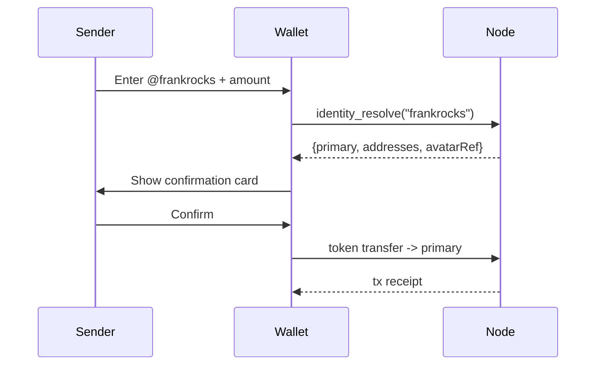
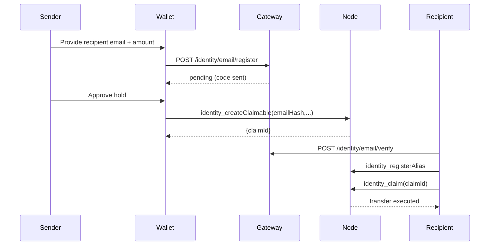

# Pay-by-Username & Email Flows

This guide outlines the wallet and service flows that enable human-friendly payments on NHBChain. The identity module resolves
aliases to settlement addresses, while claimables bridge first-time recipients via escrowed holds.

## Quick Reference

* Known alias → resolve + transfer.
* Unknown alias/email → create claimable → recipient registers alias → claim.
* QR codes encode the alias and transfer metadata using the `znhb://` URI scheme.

## 1. Direct Pay to Known Alias

1. **Input**: Sender enters `@frankrocks` in wallet UI.
2. **Resolve**: Wallet calls `identity_resolve("frankrocks")`.
3. **Safety Review**: Wallet surfaces alias, avatar, creation date, and a fingerprint of the primary address (first/last 6 chars).
4. **Confirm & Transfer**: Wallet constructs a token transfer to the returned `primary` address.
5. **Observe Events**: Clients may subscribe to `identity.alias.primarySet` to detect address changes.



### UX Checklist

* Display alias avatar (or fallback identicon) from `avatarRef`.
* Highlight creation date: "Member since May 2024".
* Render linked address fingerprint: `nhb1...r0cks`.
* Warn if alias version changed recently (possible re-assignment) by querying `identity_get`.

## 2. Pay by Email (Recipient not yet registered)

When the sender only knows an email address, claimables allow funds to be held until the recipient verifies and creates an alias.

### Sender Flow

1. Wallet hashes email: `emailHash = HMAC(salt, emailLowerNFKC)` (same as gateway). Salt is wallet-specific but consistent per
   ecosystem to enable detection of duplicates.
2. Sender signs a request payload for `identity_createClaimable` including token, amount, expiry.
3. Wallet submits the JSON-RPC call. The node places funds into the identity escrow vault and returns `claimId`.
4. Wallet optionally notifies recipient via gateway or email.

### Recipient Flow

1. Recipient receives email invite with `claimId` and instructions.
2. Recipient verifies email through the [Identity Gateway](./identity-gateway.md#post-identityemailverify).
3. Recipient registers an alias via `identity_registerAlias`.
4. Recipient signs `identity_claim(claimId, recipientSig)`.
5. Funds settle to the alias primary address; events emitted include `identity.claimable.claimed`.



### Claimable Expiry & Recovery

* `expiry` recommended minimum: 7 days. Wallets should display countdown.
* If expiry lapses before claim, funds auto-refund to payer; node emits `identity.claimable.expired`.
* Payer may cancel early via governance call (future release) but current flow relies on expiry.

## 3. Pay by QR Code

Wallets can embed alias payments into QR codes using the NHBChain intent scheme.

```
znhb://pay?to=@frankrocks&amount=25.75&token=NHB&memo=Lunch
```

* `to`: alias or aliasId. Wallets must normalize before calling `identity_resolve`.
* `amount`: decimal string (respect token precision).
* `token`: denom string.
* Additional fields: `expiry`, `callback`, `ref` (merchant reference).

### Merchant Experience

1. Merchant prints QR linking to their alias (ensure alias is verified and avatar set).
2. Customer scans; wallet resolves alias and shows avatar + verification badge.
3. Customer confirms; transfer executed as in section 1.

## 4. UX Safety Controls

* **Human confirmation**: Always show alias + avatar + creation date before payment.
* **Fingerprint**: Render a short checksum of the primary address (e.g., BLAKE3 6 chars) to catch last-minute swaps.
* **Version watch**: If `identity_get` shows `updatedAt` within the last minute, display warning banner.
* **Claimable context**: When paying by email, indicate "Funds held until frank@example.com claims by Jun 18".
* **Escrow link**: Provide "View escrow" CTA linking to [Escrow module docs](../escrow/escrow.md) for transparency.

## 5. Developer Checklist

* Integrate both JSON-RPC and Gateway APIs.
* Cache successful `identity_resolve` responses for 60 seconds to reduce load; invalidate on `identity.alias.*` events.
* For pay-by-email, store `claimId`, `token`, `amount`, and `expiry` locally for status tracking.
* Support cancellation/resend flows by creating a new claimable and marking previous as expired when funds return.

## Appendix: Sample Timeline

| Step | Sender | Recipient |
| --- | --- | --- |
| T0 | Create claimable | Receive invite |
| T+5m | — | Verify email |
| T+10m | — | Register alias |
| T+11m | — | Claim funds |
| T+12m | Auto-refund if not claimed | — |

---

For CLI-driven flows, refer to [identity-cli.md](./identity-cli.md). For security considerations, see
[identity-security-compliance.md](./identity-security-compliance.md).
