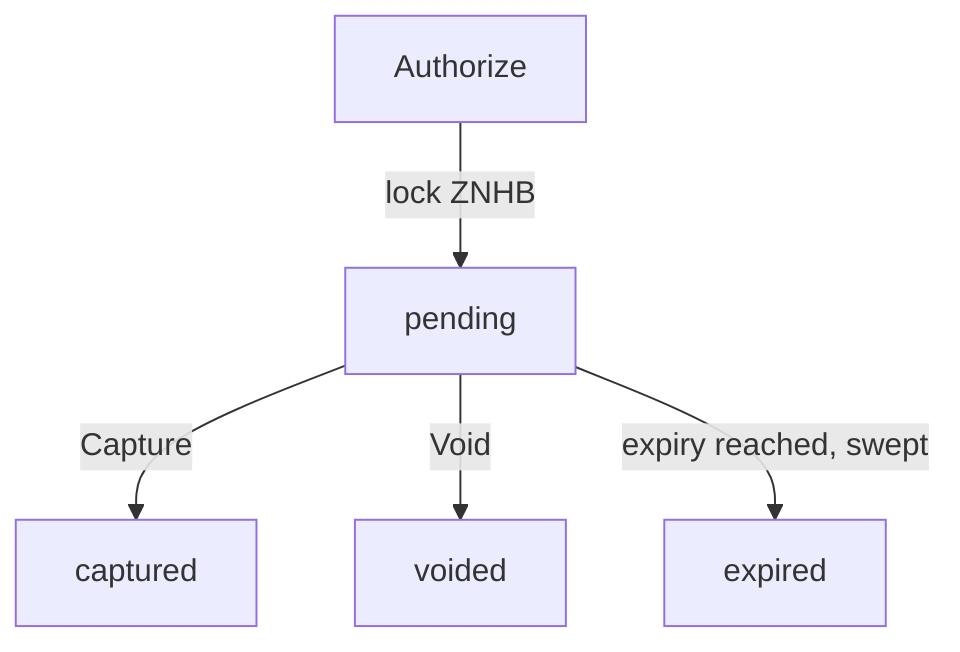

# POS payment authorization lifecycle

Card-style POS payments in ZNHB: a payer's funds are locked by an authorization,
then captured (fully or partly) by the merchant or voided. Code:
`native/pos/auth.go` (the `Lifecycle` engine), `core/state_pos.go`
(transaction handlers), `core/events/payments.go`.

This task introduces a card-style lifecycle for point-of-sale (POS) payments.
Merchants can lock ZapNHB from a payer, capture any amount up to the locked
value, or void the authorization to return funds. Expired authorizations are
voided automatically to guarantee balances are restored without manual
intervention.

Key additions include:

* A lifecycle engine that manages authorizations, captures, and voids while
  updating account balances atomically.
* Events emitted for each lifecycle milestone so downstream services can track
  payments in real time.
* Proto messages (`MsgAuthorizePayment`, `MsgCapturePayment`, `MsgVoidPayment`) for authorization, capture, and void. The gRPC service that carried them is retired; see Integration points.
* Documentation of timing guarantees, error codes, and state transitions.

## Lifecycle flow

* **Authorize**: Locks the requested ZapNHB in `LockedZNHB` and records an
  authorization ID tied to the payer, merchant, amount, expiry, and optional
  `intent_ref`.
* **Capture**: Transfers any amount up to the authorized total to the merchant
  account. Remaining funds are returned to the payer in the same transaction.
* **Void**: Releases the entire lock back to the payer. This can be triggered
  manually via a `TxTypePOSVoid` transaction or automatically when the expiry timestamp is
  reached.

## Transactions

These proto messages are defined in `proto/pos/tx.proto`. The `pos.v1.Tx` gRPC
service that carried them is retired and not registered on the node
(`rpc/http.go`, NHB-AUDIT-S3); on-chain the same operations are the
`TxTypePOSAuthorize`/`Capture`/`Void` transactions.

| Message | Description |
| --- | --- |
| `MsgAuthorizePayment` | Locks ZapNHB on the payer account. Returns `authorization_id`. |
| `MsgCapturePayment` | Captures up to the locked amount, refunding any remainder. |
| `MsgVoidPayment` | Manually voids an authorization prior to capture. |

| Type | Message | Signer must be |
| --- | --- | --- |
| `TxTypePOSAuthorize` `0x20` | `MsgAuthorizePayment` (`payer`, `merchant`, `amount`, `expiry`, `intent_ref`) | the `payer` |
| `TxTypePOSCapture` `0x21` | `MsgCapturePayment` (`authorization_id`, `amount`) | the authorization's merchant |
| `TxTypePOSVoid` `0x22` | `MsgVoidPayment` (`authorization_id`, `reason`) | the payer or the merchant |

`amount` is a decimal string of ZNHB wei. Each handler advances the signer's
account nonce on success. Other fields in those messages (`nonce`, `expires_at`,
`chain_id`) are not read by the handlers.

## Rules

**Authorize** (`Lifecycle.Authorize`): payer and merchant must be non-zero; amount
positive (`pos: amount must be positive`); `expiry` must be greater than the block
time (`pos: authorization expired`); the payer needs enough unlocked ZNHB
(`pos: insufficient balance`). Effect: payer `BalanceZNHB -= amount`, `LockedZNHB
+= amount`. The authorization id is `keccak256(payer address (20 bytes) ||
big-endian uint64 per-payer counter)`, the counter starting at 0. If an
`intent_ref` is given, an index from the reference to the id is stored so
`pos_getAuthorizationByIntentRef` can find it. Emits `payments.authorized`.

**Capture** (`Lifecycle.Capture`): caller must be the merchant
(`pos: caller is not authorized for this authorization`); amount positive and not
above the authorized amount (`pos: capture exceeds authorization`). A captured
authorization returns `pos: authorization already captured`, a voided one `pos:
authorization voided`, an expired one `pos: authorization expired`. If the block
time is at or after `expiry`, the lifecycle voids the authorization and returns
`pos: authorization expired`, so the capture transaction fails. Effect on success:
payer `LockedZNHB -= authorized amount`; merchant `BalanceZNHB += captured`;
payer `BalanceZNHB += authorized - captured`. Emits `payments.captured`.

**Void** (`Lifecycle.Void`): caller must be payer or merchant. A captured
authorization returns `pos: authorization already captured`. Voiding an already
voided or expired authorization succeeds without change. Otherwise the whole
locked amount returns to the payer's `BalanceZNHB`; the reason defaults to
`manual`. Emits `payments.voided`.

**Expiry sweep**: at the end of every block (`FinalizeBlock`) pending
authorizations with `expiry <= block time` are voided with status `expired`,
reason `expired`. Each emits `payments.voided` (`expired=true`) and
`pos.auth_auto_voided`, and increments `nhb_pos_auth_expired_total`.

If a persistence step fails inside a lifecycle call, the balance changes made by
that call are rolled back before the error is returned.

## Storage

Authorizations are stored under `pos/auth/<hex id>`, with a per-payer counter
under `pos/auth/nonce/`, a pending index under `pos/auth/pending`, and the intent
reference index under `pos/auth/intent/`.

## Events

| Event | Attributes |
| --- | --- |
| `payments.authorized` | `authorizationId`, `payer`, `merchant`, `amount`, `expiry`, `intentRef` |
| `payments.captured` | `authorizationId`, `payer`, `merchant`, `capturedAmount`, `refundedAmount` |
| `payments.voided` | `authorizationId`, `payer`, `merchant`, `refundedAmount`, `reason`, `expired` |
| `pos.auth_auto_voided` | `authorizationId`, `amount` |

Ids, payer and merchant values in these events are lowercase hex without `0x`;
attributes that would be empty or zero are omitted. Amounts are decimal strings.

## Read methods

* **gRPC service retired**: `proto/pos/tx.proto` still defines a `pos.v1.Tx`
  service (`rpc/pos_grpc.go`), but it is no longer registered on the node's
  gRPC server (`rpc/http.go` `Serve`, NHB-AUDIT-S3, retired 2026-09-18), so
  `AuthorizePayment`/`CapturePayment`/`VoidPayment` return `Unimplemented`.
  The messages carry no signature field, and the authorize handler requires
  the transaction signer to equal the payer (`core/state_pos.go`
  `applyPOSAuthorize`). Do not
  integrate against this service.
* **Real integration path**: authorize/capture/void are native transactions
  (`TxTypePOSAuthorize`/`Capture`/`Void`, `0x20`/`0x21`/`0x22`) signed
  client-side with the payer's or merchant's own wallet key and submitted via
  the standard `nhb_sendTransaction` RPC, the same path every other native
  transaction type uses.
* **Read-only lookups** (undocumented elsewhere, also exposed via
  `rpc/http.go`'s dispatch table):
  * `pos_getAuthorization(id)` -- looks up an authorization by its ID, returns
    a `POSAuthorizationResult` or `null`.
  * `pos_getAuthorizationByIntentRef(intentRef)` -- the way a merchant/gateway
    discovers an authorization ID from a client-supplied `intent_ref` after
    submitting an Authorize transaction. Same response shape.
  * `pos_sweepVoids(timestamp?)` -- retired: it answers HTTP 410 with error
    `-32060` and does nothing (`nhb-cli pos sweep-voids` reports the same and
    exits non-zero). It voided expired authorizations on the one validator
    that handled the call, outside block execution; every block already voids
    the authorizations that have passed their expiry as part of its own
    execution, so nothing needs to call it.
* **Testing**: Unit tests cover partial capture, double-capture rejection, and
  automatic expiry handling.
* **Telemetry**: Existing payment processors can subscribe to the new event
  types to synchronize state with NHBChain.
