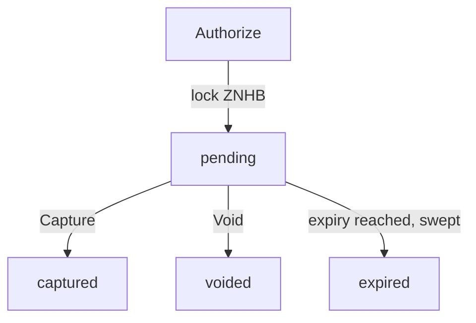

# POS payment authorization lifecycle

Card-style POS payments in ZNHB: a payer's funds are locked by an authorization,
then captured (fully or partly) by the merchant or voided. Code:
`native/pos/auth.go` (the `Lifecycle` engine), `core/state_pos.go`
(transaction handlers), `core/events/payments.go`.

## States

Status values in RPC results: `pending`, `captured`, `voided`, `expired`.

## Transactions

Submitted as signed native transactions through `nhb_sendTransaction`
([POS gateway API](../api/gateway-pos.md)); `data` is the raw protobuf of the
message in `proto/pos/tx.proto`:

| Type | Message | Signer must be |
| --- | --- | --- |
| `TxTypePOSAuthorize` `0x20` | `MsgAuthorizePayment` (`payer`, `merchant`, `amount`, `expiry`, `intent_ref`) | the `payer` |
| `TxTypePOSCapture` `0x21` | `MsgCapturePayment` (`authorization_id`, `amount`) | the authorization's merchant |
| `TxTypePOSVoid` `0x22` | `MsgVoidPayment` (`authorization_id`, `reason`) | the payer or the merchant |

`amount` is a decimal string of ZNHB wei. `authorization_id` is the hex text of
the 32-byte id, 64 characters with an optional `0x` prefix (`pos: invalid
authorization id` otherwise). Each handler advances the signer's account nonce on
success. Other fields in those messages (`nonce`, `expires_at`, `chain_id`) are not
read by the handlers. The time the rules below compare against is the block
timestamp.

## Rules

**Authorize** (`Lifecycle.Authorize`): payer and merchant must be non-zero; amount
positive (`pos: amount must be positive`); `expiry` must be greater than the block
time (`pos: authorization expired`); the payer needs enough unlocked ZNHB
(`pos: insufficient balance`). Effect: payer `BalanceZNHB -= amount`, `LockedZNHB
+= amount`. The authorization id is `keccak256(payer address (20 bytes) ||
big-endian uint64 per-payer counter)`, the counter starting at 0. If an
`intent_ref` is given, an index from the reference to the id is stored so
`pos_getAuthorizationByIntentRef` can find it. Emits `payments.authorized`.

**Capture** (`Lifecycle.Capture`): caller must be the merchant
(`pos: caller is not authorized for this authorization`); amount positive and not
above the authorized amount (`pos: capture exceeds authorization`). A captured
authorization returns `pos: authorization already captured`, a voided one `pos:
authorization voided`, an expired one `pos: authorization expired`. If the block
time is at or after `expiry`, the lifecycle voids the authorization and returns
`pos: authorization expired`, so the capture transaction fails. Effect on success:
payer `LockedZNHB -= authorized amount`; merchant `BalanceZNHB += captured`;
payer `BalanceZNHB += authorized - captured`. When the payer and the merchant are
the same account the release, the refund and the capture credit are applied to that
one account, so the capture moves nothing out of it. Emits `payments.captured`.

**Void** (`Lifecycle.Void`): caller must be payer or merchant. A captured
authorization returns `pos: authorization already captured`. Voiding an already
voided or expired authorization succeeds without change. Otherwise the whole
locked amount returns to the payer's `BalanceZNHB`; the reason defaults to
`manual`. Emits `payments.voided`.

**Expiry sweep**: at the end of every block (`FinalizeBlock`) pending
authorizations with `expiry <= block time` are voided with status `expired`,
reason `expired`. Each emits `payments.voided` (`expired=true`) and
`pos.auth_auto_voided`, and increments `nhb_pos_auth_expired_total`.

If a persistence step fails inside a lifecycle call, the balance changes made by
that call are rolled back before the error is returned.

## Storage

Authorizations are stored under `pos/auth/<hex id>`, with a per-payer counter
under `pos/auth/nonce/`, a pending index under `pos/auth/pending`, and the intent
reference index under `pos/auth/intent/`.

## Events

| Event | Attributes |
| --- | --- |
| `payments.authorized` | `authorizationId`, `payer`, `merchant`, `amount`, `expiry`, `intentRef` |
| `payments.captured` | `authorizationId`, `payer`, `merchant`, `capturedAmount`, `refundedAmount` |
| `payments.voided` | `authorizationId`, `payer`, `merchant`, `refundedAmount`, `reason`, `expired` |
| `pos.auth_auto_voided` | `authorizationId`, `amount` |

Ids, payer and merchant values in these events are lowercase hex without `0x`;
attributes that would be empty or zero are omitted. Amounts are decimal strings.

## Read methods

`pos_getAuthorization` and `pos_getAuthorizationByIntentRef` (no auth) are described
in [POS gateway API](../api/gateway-pos.md). `pos_sweepVoids` is retired: it answers
HTTP 410 with code `-32060` and does nothing (`rpc/http.go`), and `nhb-cli pos
sweep-voids` says so and exits non-zero without contacting the node
(`cmd/nhb-cli/retired_cmd.go`). It used to run the expiry sweep on the one node that
received the call, outside block execution; the expiry sweep above already runs at
the end of every block.
