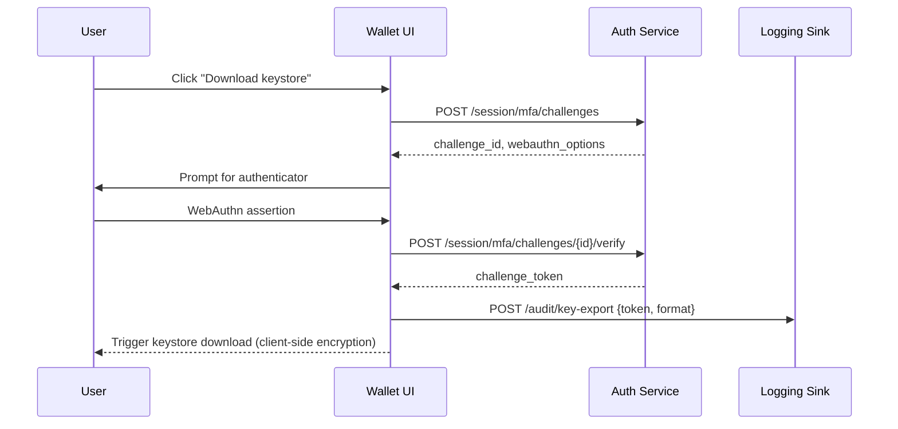

# Wallet Key Management UX Patterns

Wallet builders must pair ergonomic flows with controls that respect NHBChain's
identity and custody requirements. Mutating identity APIs already enforce
secp256k1 signatures and HMAC-authenticated gateway calls, while off-chain PII
(such as email hashes) stays inside the gateway boundary with rotation and audit
logging requirements.【F:docs/identity/identity-security-compliance.md†L20-L31】
Key reveal and recovery screens therefore need to reinforce that private keys
never leave the client's trust zone, and that operators maintain strong custody
processes for any mirrored infrastructure such as hardware signing bridges or
KMS backends.【F:docs/p2p/security-and-compliance.md†L34-L36】

## Shared guardrails

Wallets should surface security posture cues alongside every sensitive action:

- Explain why the user must complete multi-factor authentication (MFA), and map
  the challenge type to the organisation's WebAuthn policy so the behaviour
  matches the rest of the custody tooling.【F:docs/otc/security.md†L5-L8】
- Highlight that plaintext keys and seed phrases are never transmitted to the
  NHB gateway or identity APIs; the client only sends signatures, consistent with
  the platform's on-chain custody boundary.【F:docs/identity/identity-security-compliance.md†L20-L31】
- Provide an audit trail export (`.csv` or `.json`) that records who initiated a
  reveal, import, or recovery event and whether the MFA challenge succeeded. This
  log should mirror the gateway's audit trails so compliance reviews can match
  client UI actions with backend events.【F:docs/identity/identity-security-compliance.md†L47-L56】

## 2FA-gated key reveal

Expose private keys only after a fresh MFA assertion and make the UI friction
obvious. Recommended state machine:

| State | UI treatment | Example API flow |
| --- | --- | --- |
| `locked` | Key area blurred/disabled with "Reveal key" button. | `POST /session/mfa/challenges` → returns challenge ID and WebAuthn options. |
| `challenge_in-flight` | Modal prompts hardware key or authenticator app, "Cancel" aborts. | `navigator.credentials.get()` → `POST /session/mfa/challenges/{id}/verify`. |
| `revealed` | Key rendered inside copy-to-clipboard component; auto-hides on blur. | `PATCH /session/key-reveal` with verified challenge token → logs event. |

Additional UX recommendations:

1. Show a countdown timer (e.g., 30 seconds) after reveal. When the timer
   expires, wipe the rendered key and return to `locked`.
2. Gate download/export behind a secondary "Hold to confirm" control to prevent
   accidental clipboard copies.
3. Display the account alias, last verified email, and last sign-in timestamp so
   operators can verify the user context before confirming the reveal. These
   fields should be fetched via `identity_resolve` using server-side bearer
   tokens, keeping PII checks inside the custody perimeter.【F:docs/identity/identity-security-compliance.md†L25-L36】

## Private-key import and export

Wallets that support bring-your-own keys must keep serialization purely
client-side and validate inputs before any signing attempt:

1. **Import flow**
   - `idle`: Accepts pasted hex or uploaded keystore. Immediately derive and show
     the NHB bech32 address so users can confirm the target account before
     storage.
   - `validating`: Run checksum validation (e.g., `keccak256` comparison for
     keystores) and prompt for a passphrase if the format requires it. During
     this state, disable network requests to avoid leaking encrypted blobs.
   - `ready`: Persist in ephemeral memory only (e.g., React state or secure
     worker). Provide a CTA to connect hardware wallets or register the key with
     a server-side signing bridge if the organisation uses shared custody.

2. **Export flow**
   - Offer "Download encrypted keystore" and "Copy seed phrase" separately. Both
     must remain disabled until a verified MFA challenge token is present.
   - Attach warnings that exported files fall outside the NHB gateway's custody
     guarantees and must be stored in an approved vault or HSM, matching the
     organisation's custody playbook.【F:docs/p2p/security-and-compliance.md†L34-L36】
   - Emit structured audit events describing which format was exported and where
     the user indicated the secret will be stored.

API example for export:

## Recovery safeguards

Design recovery to encourage redundancy without weakening custody posture:

- Offer recovery phrase confirmation with spaced repetition (e.g., select words
  3, 12, and 20) and require the user to acknowledge that the phrase must be
  stored offline. This echoes the platform's guarantee that plaintext recovery
  data never leaves the client boundary.【F:docs/identity/identity-security-compliance.md†L25-L31】
- Let administrators register hardware factors or custody bridges as secondary
  signers so emergency rotations can be triggered without exposing seeds to
  shared infrastructure.【F:docs/p2p/security-and-compliance.md†L34-L36】
- Provide a "view-only" recovery mode that restores account history via
  `nhb_getBalance` and `identity_resolve` while keeping signing disabled. This
  allows support staff to assist users without inheriting signing authority.
- Include break-glass instructions referencing where off-chain proofs and audit
  logs live so the organisation can document the rotation in downstream systems
  that already track WebAuthn and gateway events.【F:docs/identity/identity-security-compliance.md†L47-L56】

## Further reading

- [Wallet builder guide](../sdk/wallets.md)
- [Identity security, privacy & compliance brief](../identity/identity-security-compliance.md)
- [OTC security model](../otc/security.md)
- [P2P security & compliance guidance](../p2p/security-and-compliance.md)
